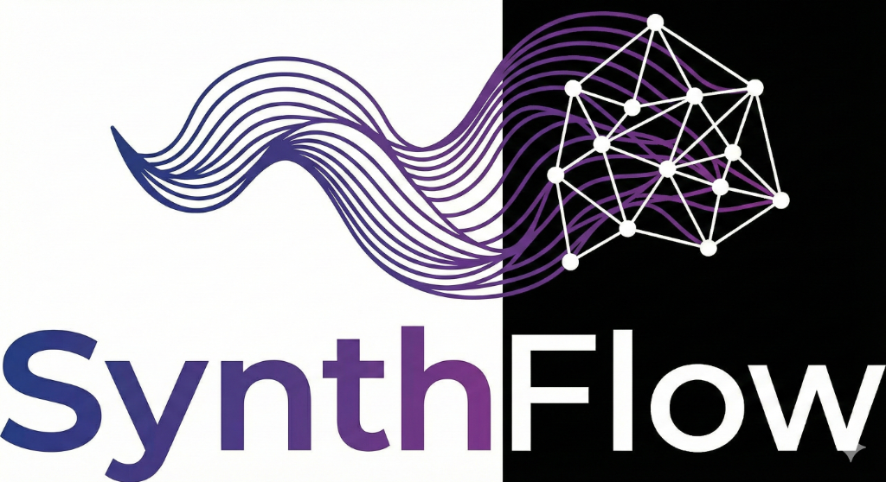

# SynthFlow Programming Language



[](https://github.com/WEE-TECHNOLOGY-SOLUTION/SynthFlow/actions)
[](https://github.com/WEE-TECHNOLOGY-SOLUTION/SynthFlow/releases)
[](LICENSE)

SynthFlow is an **AI-native programming language** designed to bridge the gap between human intent and machine execution. It features a clean, readable syntax with powerful constructs for modern software development, native AI integration, and now **Quantum Computing** simulation.

## ✨ Key Features

### Core Language
- **Clean Syntax** – Easy to read and write like Python/TypeScript
- **Type Safety** – Optional type annotations, null safety
- **Control Flow** – if/else, while, for loops, break, continue
- **Functions** – First-class functions with lambdas
- **Collections** – Arrays and maps with literal syntax

### ⚛️ Quantum Computing (New!)
- **State Vector Simulation** – Simulate quantum states and amplitudes
- **Complex Numbers** – First-class support for complex arithmetic
- **Quantum Gates** – Hadamard, Pauli-X/Y/Z, CNOT, and more
- **Algorithms** – Helpers for Grover's search, Bell states, etc.

### AI & Agent Development (SADK)
- **🤖 Native AI Integration** – Built-in Gemini API support
- **🧠 Agent Framework** – Create intelligent AI agents
- **📡 HTTP Client** – Native HTTP requests
- **📊 Vector Store** – RAG support for AI applications

### 🔌 Model Context Protocol (MCP)
- **AI IDE Integration** – Connect SynthFlow to VS Code, Claude Desktop, and other AI tools
- **Native C++ Server** – High-performance MCP server (`synthflow-mcp`)
- **Tool Exposure** – Expose SynthFlow capabilities as AI-callable tools

## 🚀 Quick Start

```bash
# Clone the repository
git clone https://github.com/WEE-TECHNOLOGY-SOLUTION/SynthFlow.git
cd synthflow

# Build (Windows)
.\build.bat

# Run a quantum demo
.\synthflow run examples/quantum_demo.sf
```

## ⚛️ Quantum Computing

SynthFlow now supports quantum programming primitives:

```synthflow
import quantum

// Create a 2-qubit system initialized to |00⟩
let qs = quantum.createSystem(2)

// Apply Hadamard gate to first qubit -> Superposition
qs.applyUnknownGate("H", 0)

// Apply CNOT gate (Control: 0, Target: 1) -> Entanglement
qs.applyCNOT(0, 1)

// Measure the system
let result = qs.measureAll()
print("Measurement result: " + result)
```

## 🤖 AI Integration (Gemini)

SynthFlow has **native Google Gemini API integration**:

```synthflow
// Set your API key
gemini_set_api_key("YOUR_API_KEY")

// Chat with system prompt
let answer = gemini_chat(
    "You are a helpful assistant.",
    "Explain quantum computing briefly.",
    "gemini-2.0-flash"
)
print(answer)
```

## 📦 Standard Library

| Module | Description | Status |
|--------|-------------|--------|
| `stdlib/quantum.sf` | Quantum computing simulation | ✅ Ready |
| `stdlib/complex.sf` | Complex number arithmetic | ✅ Ready |
| `stdlib/ai.sf` | AI model integration | ✅ Ready |
| `stdlib/agent.sf` | Agent framework | ✅ Ready |
| `stdlib/http.sf` | HTTP client | ✅ Ready |
| `stdlib/json.sf` | JSON utilities | ✅ Ready |
| `stdlib/io.sf` | File I/O operations | ✅ Ready |

## 🔧 Built-in Functions

### Math & Numbers
| Function | Description |
|----------|-------------|
| `sqrt(x)` | Square root |
| `pow(x, y)` | Power (x^y) |
| `sin(x)`, `cos(x)` | Trigonometry |
| `abs(x)` | Absolute value |
| `round(x)` | Round to nearest integer |

### Core & Collections
| Function | Description |
|----------|-------------|
| `print(...)` | Print to stdout |
| `len(x)` | Get length of array/string |
| `append(arr, item)` | Add item to array |
| `push(arr, item)` | Alias for append |
| `typeof(x)` | Get type name string |

## 🏷️ Changelog

### v0.0.26 (MCP Update)
- 🔌 **Model Context Protocol (MCP) Server**
  - Native C++ implementation (`synthflow-mcp`)
  - JSON-RPC over stdio communication
  - Tool integration for AI IDEs (VS Code, Claude Desktop)
- 🔄 **CI/CD Pipeline**
  - Added `ci.yml` for continuous testing
  - Updated `release.yml` to package MCP server
- 📦 **Build System**
  - Updated `CMakeLists.txt` with `synthflow-mcp` target
  - Updated `build.bat` for local development

### v0.0.25 (Quantum Update)
- ⚛️ **Native Quantum Computing Support**
  - Complex number arithmetic and utilities
  - Qubit state simulation and gate operations
  - Quantum standard library (`stdlib/quantum.sf`)
- 🔢 **New Math Built-ins**: `sqrt`, `pow`, `abs`, `sin`, `cos`, `exp`, `ln`, `floor`, `ceil`
- 🛠️ **Language Improvements**:
  - Logical operators `&&` and `||`
  - Variadic function arguments support
  - Fixed `if/else` control flow parsing
  - Lambda type annotations
- 🐛 **Critical Fixes**:
  - Fixed `std::get` runtime variant error in Lexer
  - Resolved ownership issues in AST construction

### v0.1.0
- 🤖 **Native Gemini API integration**
- 🧠 **SADK (SynthFlow Agent Development Kit)**
- ✨ Map literals and Member access
- ✨ Lambda functions and String interpolation