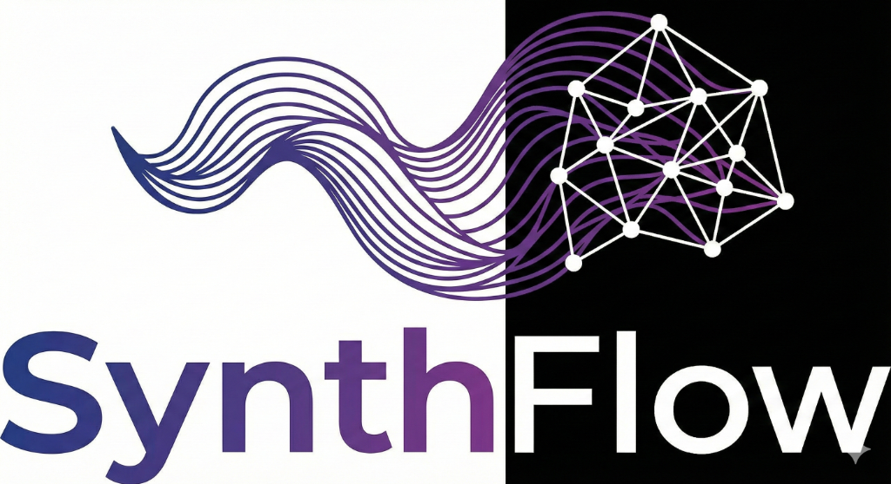

# SynthFlow Programming Language

<div align="center">



**An AI-Native Programming Language for the Future**

[](https://github.com/WEE-TECHNOLOGY-SOLUTION/SynthFlow/actions)
[](https://github.com/WEE-TECHNOLOGY-SOLUTION/SynthFlow/releases)
[](LICENSE)
[](https://github.com/WEE-TECHNOLOGY-SOLUTION/SynthFlow/releases)

[Getting Started](#-getting-started) • [Features](#-features) • [Documentation](#-documentation) • [Examples](#-examples) • [Contributing](#-contributing)

</div>

---

## Overview

SynthFlow is a modern, AI-native programming language designed to bridge the gap between human intent and machine execution. With clean, readable syntax inspired by Python and TypeScript, SynthFlow empowers developers to build intelligent applications with native AI integration, quantum computing simulation, and cross-platform deployment.

### Why SynthFlow?

| Feature | Description |
|---------|-------------|
| **AI-First Design** | Native integration with OpenAI and Google Gemini APIs |
| **Quantum Computing** | Built-in quantum gate simulation and state vectors |
| **Cross-Platform** | Compile to native binaries, JavaScript, or WebAssembly |
| **Modern Tooling** | LSP server, MCP server, and REPL for rapid development |
| **Rich Ecosystem** | 30+ standard library modules for common tasks |

---

## Features

### Core Language

- **Clean Syntax** — Readable and expressive like Python/TypeScript
- **Type Safety** — Optional type annotations with null safety
- **First-Class Functions** — Lambdas, closures, and higher-order functions
- **Pattern Matching** — Powerful match expressions for control flow
- **Modules & Imports** — Organize code with a module system

### AI & Agent Development

```synthflow
import ai

// Configure AI provider
ai.set_provider("gemini")
ai.set_api_key(env.get("GEMINI_API_KEY"))

// Chat completion
let response = ai.chat("Explain quantum computing in one sentence.")
print(response)

// Create an AI agent
let agent = ai.create_agent(
    name: "ResearchAssistant",
    system_prompt: "You are a helpful research assistant."
)
let answer = agent.ask("What is the speed of light?")
```

### Quantum Computing

```synthflow
import quantum

// Create a 2-qubit system |00⟩
let qs = quantum.create_system(2)

// Apply Hadamard gate → Superposition
qs.h(0)

// Apply CNOT gate → Entanglement (Bell state)
qs.cnot(0, 1)

// Measure
let result = qs.measure_all()
print("Measured: " + result)
```

### WebAssembly Transpilation

```synthflow
// Compile to WebAssembly for browser execution
// synthflow transpile app.sf -t wasm -o app.wat

fn fibonacci(n: int) -> int {
    if n <= 1 { return n }
    return fibonacci(n - 1) + fibonacci(n - 2)
}

print(fibonacci(10))  // Output: 55
```

### HTTP & Web Framework

```synthflow
import http

// HTTP Client
let response = http.get("https://api.example.com/data")
let data = json.parse(response.body)

// HTTP Server
http.server(8080)
    .get("/", fn(req, res) { res.send("Hello, World!") })
    .get("/api/users/:id", fn(req, res) {
        res.json({ id: req.params.id, name: "User" })
    })
    .start()
```

---

## Getting Started

### Prerequisites

- **C++17 Compiler** (MSVC, GCC, or Clang)
- **CMake 3.14+**
- **Git**

### Installation

#### Windows

```powershell
# Clone the repository
git clone https://github.com/WEE-TECHNOLOGY-SOLUTION/SynthFlow.git
cd SynthFlow

# Build with CMake
cmake -B build -DCMAKE_BUILD_TYPE=Release
cmake --build build --config Release

# Add to PATH (optional)
setx PATH "%PATH%;%CD%\build\bin\Release"
```

#### macOS

```bash
# Clone the repository
git clone https://github.com/WEE-TECHNOLOGY-SOLUTION/SynthFlow.git
cd SynthFlow

# Install dependencies
brew install cmake libcurl

# Build
cmake -B build -DCMAKE_BUILD_TYPE=Release
cmake --build build

# Add to PATH (optional)
export PATH="$PWD/build/bin:$PATH"
```

#### Linux

```bash
# Clone the repository
git clone https://github.com/WEE-TECHNOLOGY-SOLUTION/SynthFlow.git
cd SynthFlow

# Install dependencies (Ubuntu/Debian)
sudo apt-get update
sudo apt-get install -y build-essential cmake libcurl4-openssl-dev

# Build
cmake -B build -DCMAKE_BUILD_TYPE=Release
cmake --build build

# Add to PATH (optional)
export PATH="$PWD/build/bin:$PATH"
```

### Verify Installation

```bash
synthflow --version
# Output: SynthFlow v0.0.30

synthflow --help
# Display available commands
```

### Hello World

Create `hello.sf`:

```synthflow
print("Hello, SynthFlow!")
```

Run it:

```bash
synthflow run hello.sf
# Output: Hello, SynthFlow!
```

---

## Documentation

### Standard Library

SynthFlow includes a comprehensive standard library for modern development:

| Category | Modules | Description |
|----------|---------|-------------|
| **AI & ML** | `ai.sf`, `agent.sf`, `neural_network.sf` | AI integration, agent framework, neural networks |
| **Data Science** | `dataframe.sf`, `numpy.sf`, `statistics.sf` | Data manipulation, numerical computing, statistics |
| **Quantum** | `quantum.sf`, `complex.sf` | Quantum computing simulation, complex numbers |
| **Web** | `http.sf`, `api.sf`, `scraping.sf` | HTTP client/server, API development, web scraping |
| **System** | `os.sf`, `subprocess.sf`, `threading.sf` | OS utilities, process management, concurrency |
| **Security** | `crypto.sf`, `security.sf` | Encryption, JWT, OAuth2, input validation |
| **Utilities** | `json.sf`, `regex.sf`, `logging.sf` | JSON parsing, pattern matching, logging |

### CLI Commands

```bash
# Run a SynthFlow file
synthflow run <file.sf>

# Start REPL
synthflow repl

# Transpile to JavaScript
synthflow transpile <file.sf> -t js -o output.js

# Transpile to WebAssembly
synthflow transpile <file.sf> -t wasm -o output.wat

# Start LSP server
synthflow-lsp

# Start MCP server
synthflow-mcp
```

### Built-in Functions

#### Math & Numbers

| Function | Description |
|----------|-------------|
| `sqrt(x)` | Square root |
| `pow(x, y)` | Power (x^y) |
| `sin(x)`, `cos(x)`, `tan(x)` | Trigonometry |
| `abs(x)` | Absolute value |
| `round(x)`, `floor(x)`, `ceil(x)` | Rounding |
| `random()` | Random number [0, 1) |
| `min(a, b)`, `max(a, b)` | Min/Max values |

#### Collections

| Function | Description |
|----------|-------------|
| `len(x)` | Length of array/string/map |
| `arr.push(item)` | Add item to array |
| `arr.pop()` | Remove and return last item |
| `arr.slice(start, end)` | Extract subarray |
| `map.keys()` | Get map keys |
| `map.values()` | Get map values |

#### Strings

| Function | Description |
|----------|-------------|
| `str.upper()`, `str.lower()` | Case conversion |
| `str.split(sep)` | Split into array |
| `str.trim()` | Remove whitespace |
| `str.contains(sub)` | Check substring |
| `str.replace(old, new)` | Replace substring |

---

## Examples

### AI Agent Example

```synthflow
import ai
import agent

// Create a conversational agent
let bot = agent.create({
    name: "CodeHelper",
    provider: "gemini",
    model: "gemini-2.0-flash",
    system_prompt: "You are a helpful coding assistant.",
    tools: ["code_analysis", "documentation_search"]
})

// Interactive loop
while true {
    let input = io.prompt("You: ")
    if input == "exit" { break }

    let response = bot.chat(input)
    print("Bot: " + response)
}
```

### Data Processing

```synthflow
import dataframe
import statistics

// Load and analyze data
let df = dataframe.read_csv("sales.csv")

// Filter and aggregate
let summary = df
    .filter(fn(row) { row.amount > 1000 })
    .group_by("region")
    .aggregate({ total: "sum", count: "count" })

print(summary)

// Statistical analysis
let values = df.column("amount")
print("Mean: " + statistics.mean(values))
print("Std Dev: " + statistics.std(values))
```

### Web API

```synthflow
import http
import json

// REST API Server
let server = http.server(3000)

// Middleware
server.use(fn(req, res, next) {
    print("${req.method} ${req.path}")
    next()
})

// Routes
server.get("/api/users", fn(req, res) {
    res.json({
        users: [
            { id: 1, name: "Alice" },
            { id: 2, name: "Bob" }
        ]
    })
})

server.post("/api/users", fn(req, res) {
    let user = json.parse(req.body)
    // Save to database...
    res.status(201).json({ created: user })
})

server.start()
print("Server running on http://localhost:3000")
```

---

## Architecture

```
SynthFlow/
├── compiler/
│   ├── src/
│   │   ├── lexer/          # Lexical analysis
│   │   ├── parser/         # Syntax parsing
│   │   ├── semantic/       # Semantic analysis
│   │   ├── interpreter/    # Tree-walking interpreter
│   │   └── codegen/        # Code generation (JS, Wasm)
│   └── include/            # Header files
├── stdlib/                 # Standard library modules
│   ├── ai.sf              # AI integration
│   ├── quantum.sf         # Quantum computing
│   ├── http.sf            # HTTP client/server
│   └── ...                # 30+ modules
├── lsp-server/            # Language Server Protocol
├── mcp-server/            # Model Context Protocol
├── examples/              # Example programs
└── tests/                 # Test suite
```

---

## Contributing

We welcome contributions! Please see our [Contributing Guide](CONTRIBUTING.md) for details.

### Development Setup

```bash
# Fork and clone
git clone https://github.com/YOUR_USERNAME/SynthFlow.git
cd SynthFlow

# Create a branch
git checkout -b feature/my-feature

# Build in debug mode
cmake -B build -DCMAKE_BUILD_TYPE=Debug
cmake --build build

# Run tests
cd build && ctest

# Submit a pull request
```

### Code Style

- Follow C++17 best practices
- Use meaningful variable names
- Add comments for complex logic
- Write tests for new features

---

## Roadmap

### v0.1.0 (Upcoming)

- [ ] Garbage collection
- [ ] Async/await support
- [ ] Native threading
- [ ] Package manager

### v0.2.0 (Planned)

- [ ] JIT compilation
- [ ] LLVM backend
- [ ] IDE plugins
- [ ] Online playground

---

## License

SynthFlow is released under the [MIT License](LICENSE).

---

## Community

- **Issues**: [GitHub Issues](https://github.com/WEE-TECHNOLOGY-SOLUTION/SynthFlow/issues)
- **Discussions**: [GitHub Discussions](https://github.com/WEE-TECHNOLOGY-SOLUTION/SynthFlow/discussions)
- **Email**: support@synthflow.dev

---

## Acknowledgments

Built with modern C++ and inspired by the best features of Python, TypeScript, and Rust. Special thanks to all contributors and the open-source community.

---

<div align="center">

**[⬆ Back to Top](#synthflow-programming-language)**

Made with ❤️ by the SynthFlow Team

</div>