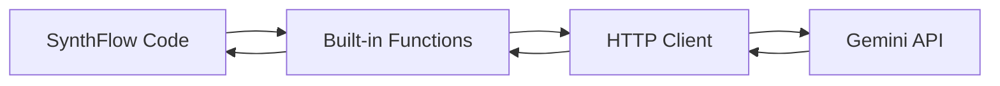

# Gemini API Integration Guide

This guide explains how to use Google's Gemini AI models in SynthFlow.

## Quick Start

```synthflow
// 1. Set your API key
gemini_set_api_key("YOUR_API_KEY_HERE")

// 2. Make a completion request
let response = gemini_complete("What is the capital of France?", "gemini-2.0-flash")
print(response)
```

## Getting an API Key

1. Go to [Google AI Studio](https://ai.google.dev)
2. Sign in with your Google account
3. Click **Get API Key** → **Create API key**
4. Copy the key and use it in your SynthFlow code

> [!IMPORTANT]
> Keep your API key secret! Never commit it to version control.

## Built-in Functions

### `gemini_set_api_key(key)`

Sets the global API key for all Gemini requests.

```synthflow
gemini_set_api_key("AIza...")
```

---

### `gemini_has_api_key()`

Returns `true` if an API key has been configured.

```synthflow
if gemini_has_api_key() {
    print("API key is set")
}
```

---

### `gemini_complete(prompt, model)`

Makes a text completion request.

| Parameter | Type   | Description                        |
|-----------|--------|------------------------------------|
| `prompt`  | string | The text prompt to send            |
| `model`   | string | Model name (e.g., `gemini-2.0-flash`) |

**Returns:** The generated text response, or an error message starting with `[Error: ...]`

```synthflow
let result = gemini_complete("Explain quantum computing in one sentence", "gemini-2.0-flash")
print(result)
```

---

### `gemini_chat(systemPrompt, userPrompt, model)`

Makes a chat completion request with a system instruction.

| Parameter      | Type   | Description                         |
|----------------|--------|-------------------------------------|
| `systemPrompt` | string | Instructions for how the AI should behave |
| `userPrompt`   | string | The user's message                  |
| `model`        | string | Model name (e.g., `gemini-2.0-flash`)  |

**Returns:** The generated response, or an error message.

```synthflow
let response = gemini_chat(
    "You are a helpful coding assistant. Be concise.",
    "How do I reverse a string in Python?",
    "gemini-2.0-flash"
)
print(response)
```

## Available Models

| Model               | Description                    | Best For            |
|---------------------|--------------------------------|---------------------|
| `gemini-2.0-flash`  | Fast, efficient responses      | General tasks       |
| `gemini-1.5-pro`    | More capable, slower           | Complex reasoning   |
| `gemini-1.5-flash`  | Balanced speed/quality         | Most applications   |

## Error Handling

Errors are returned as strings starting with `[Error: ...]`:

```synthflow
let result = gemini_complete("Hello", "gemini-2.0-flash")

// Check for errors (simple approach)
// Note: A more robust check would use string contains
print(result)
```

### Common Errors

| Error Code | Meaning                        | Solution                          |
|------------|--------------------------------|-----------------------------------|
| 400        | Bad request                    | Check your prompt format          |
| 401        | Invalid API key                | Verify your API key               |
| 429        | Rate limit exceeded            | Wait and retry, or upgrade quota  |
| 500        | Server error                   | Retry later                       |

## Complete Example

```synthflow
// Configure API
gemini_set_api_key("AIzaSy...")

// Simple completion
let capital = gemini_complete("What is the capital of Japan?", "gemini-2.0-flash")
print("Capital: " + capital)

// Chat with system instruction
let code = gemini_chat(
    "You are a Python expert. Provide only code, no explanations.",
    "Write a function to calculate factorial",
    "gemini-2.0-flash"
)
print("Generated code:")
print(code)
```

## Rate Limits

The free tier has usage limits:
- **Requests per minute:** 15
- **Requests per day:** 1,500
- **Tokens per minute:** 1,000,000

If you hit rate limits (HTTP 429), wait a few seconds and retry.

> [!TIP]
> For production use, enable billing at [Google Cloud Console](https://console.cloud.google.com) for higher limits.

## Using with the AI Module

The `stdlib/ai.sf` module provides higher-level functions:

```synthflow
// Import and configure (once module loading is implemented)
// import ai from "stdlib/ai.sf"

// For now, use the built-in functions directly
gemini_set_api_key("YOUR_KEY")

// The ai.sf module wraps these built-ins
// ai.complete(prompt) -> calls gemini_complete internally
// ai.chat(messages) -> calls gemini_chat internally
```

## Using with the Agent Module

Build AI agents with the `stdlib/agent.sf` module:

```synthflow
// Set API key first
gemini_set_api_key("YOUR_KEY")

// Create an agent (simplified example)
let agent = {
    name: "Assistant",
    systemPrompt: "You are a helpful assistant.",
    model: "gemini-2.0-flash"
}

// Process a message
let response = gemini_chat(agent.systemPrompt, "Hello!", agent.model)
print(response)
```

## Troubleshooting

### "API key not set"
Call `gemini_set_api_key()` before making requests.

### "HTTP 429" errors
You've hit the rate limit. Wait 10-60 seconds and retry.

### Empty or unexpected responses
- Verify your API key is valid
- Check that the model name is correct
- Ensure your prompt is not empty

### Connection errors
- Check your internet connection
- Verify firewall settings allow HTTPS to `generativelanguage.googleapis.com`

## Architecture



The integration uses:
- **WinHTTP** for HTTPS requests on Windows
- **JSON** request/response format
- **x-goog-api-key** header for authentication
